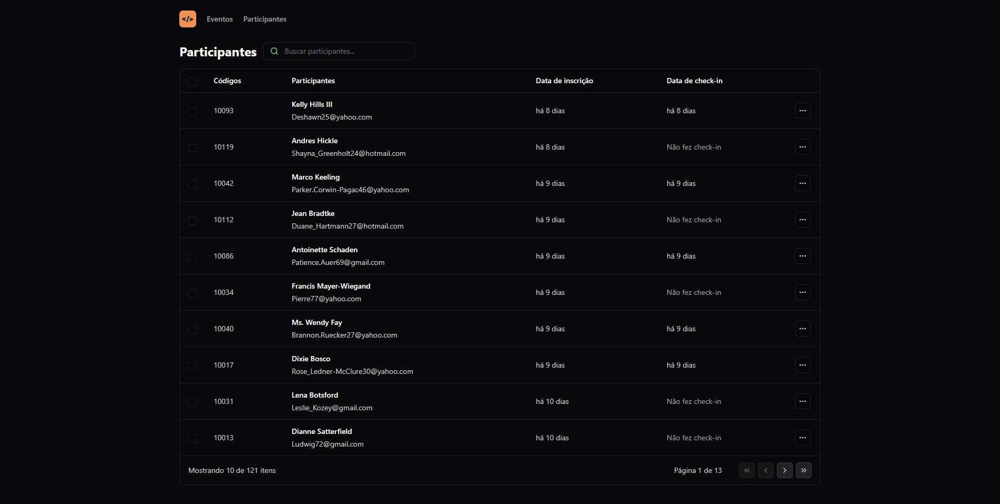

  

    
  

  
  
  
  

    
    
    <h2>
      Made with 💜
    </h2>
  

# 📷 Screenshots

  

# 🚀 Running 

 To run this application, clone this repository by: `$ git clone https://github.com/raphaacosta/pass-in-web.git`.
 - Install the dependencies by: `$ npm i`.
 - Run `$ npm run dev` (if the browser don't open, open it and access `http://localhost:5173/`)

# 📌 Techs

 - [Npm](https://nodejs.org/en)
 - [Typescript](https://www.typescriptlang.org/)
 - [React.js](https://pt-br.reactjs.org/)
 - [Tailwindcss](https://tailwindcss.com/)
 - [Dayjs](https://day.js.org/)
